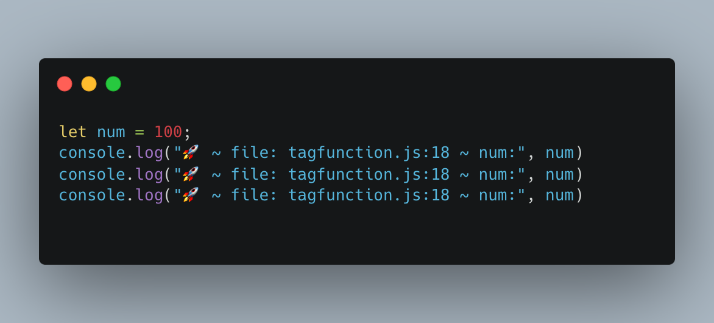

## Turbo Console Log
前端开发必备的打印神器，众所周知前端开发的时候会大量使用 “console.log()” 方法，每次都手敲会十分不便。而这个插件为我们解决了这个难题。

选中你要打印的变量（上图使用num这个变量）
- 快捷打印变量：control + option + L
- 注释所有的打印：option + shift + C
- 取消注释所有的打印：option + shift + U
- 删除所有的打印语句：option + shift + D

因为我用的是Mac所以以上快捷键都是Mac系统的
## carbon-now-sh
这是一个提升逼格的插件，我们在开发的时候难免会遇到一些代码上的问题需要请教领导或同事，如果我们直接复制一大段代码给他们，难免有点不雅，并且有些代码会乱码，所以我们需要这个插件，将代码生成一张图片，使用方法也很简单。
1. 选中你要生成图片的代码
2. 打开命令行托盘：
```
- Window - Ctrl + Shift + P
- Mac - Cmd + Shift + P
```
3. 输入 “Carbon”，点击它
完成上述步骤之后，会跳转到一个网页，你可以设置图片的颜色以及代码的格式，如下图所示:

进行一些简单的设置你想要的风格和样式，就可以下载和复制图片啦
## Vetur
Vetur 是为 Vue 开发量身打造的插件，当你新建一个空的 Vue 文件，在文件内输入 vue 关键字，能联想一些 vue 文件的快速模板，帮助你快速生成 vue 模板页面，大大提高了开发效率。
## open-in-browser
写好页面，打开浏览器是很正常的一步操作，但是就是这么正常的操作，有时候会变得很麻烦。VS Code 没有自带打开默认浏览器的功能，所以我们需要这个插件去弥补这个遗憾。